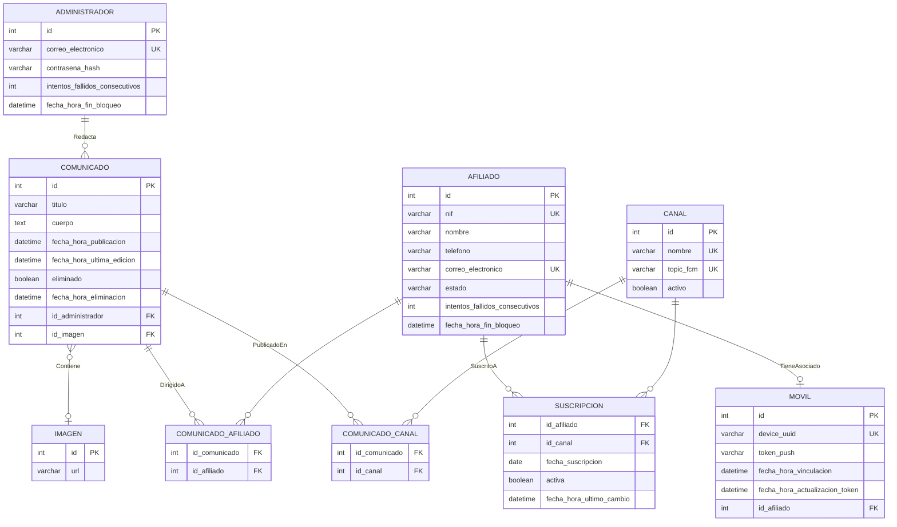

# Modelo de Datos - SIDI

## 1. Origen y Metodología

El presente modelo de datos se deriva del **Modelo del Dominio** aplicando las reglas de conversión propuestas por Craig Larman en *Applying UML and Patterns*:

| Regla Larman | Aplicación |
| --- | --- |
| Cada clase conceptual → tabla | `Administrador`, `Comunicado`, `Imagen`, `Afiliado`, `Canal`, `Movil` |
| Cada atributo → columna (tipo apropiado) | Atributos primitivos mapeados con tipos SQL |
| Asociación 1-a-muchos → FK en el lado "muchos" | `Redacta` (Administrador → Comunicado), `Contiene` (Comunicado → Imagen) |
| Asociación muchos-a-muchos → tabla de asociación con dos FK | `DirigidoA` → `COMUNICADO_AFILIADO`, `PublicadoEn` → `COMUNICADO_CANAL` |
| Clase de asociación → tabla propia con FK a ambas clases y sus atributos | `SuscritoA` → `SUSCRIPCION` |
| Asociación 1-a-1 (opcional) → FK en el lado opcional | `TieneAsociado` → FK en `MOVIL` |
| Clave primaria surrogate | Añadida donde no existe clave natural estable |

---

## 2. Diagrama Entidad-Relación

---

## 3. Descripción de Tablas

### 3.1 `ADMINISTRADOR`

> Origen: clase conceptual `Administrador`. Regla: clase → tabla.

| Columna | Tipo | Restricciones | Descripción |
| --- | --- | --- | --- |
| `id` | `INT` | PK, AUTO_INCREMENT | Clave primaria surrogate |
| `correo_electronico` | `VARCHAR(255)` | NOT NULL, UNIQUE | Identificador de acceso |
| `contrasena_hash` | `VARCHAR(255)` | NOT NULL | Hash seguro de contraseña |
| `intentos_fallidos_consecutivos` | `INT` | NOT NULL, DEFAULT 0 | Contador para bloqueo por intentos fallidos |
| `fecha_hora_fin_bloqueo` | `DATETIME` | NULL | Fecha/hora hasta la que la cuenta está bloqueada |

---

### 3.2 `AFILIADO`

> Origen: clase conceptual `Afiliado`. Regla: clase → tabla; atributos → columnas.

| Columna | Tipo | Restricciones | Descripción |
| --- | --- | --- | --- |
| `id` | `INT` | PK, AUTO_INCREMENT | Clave primaria surrogate |
| `nif` | `VARCHAR(20)` | NOT NULL, UNIQUE | Número de Identificación Fiscal |
| `nombre` | `VARCHAR(255)` | NOT NULL | Nombre completo |
| `telefono` | `VARCHAR(20)` | NOT NULL | Teléfono de credencial |
| `correo_electronico` | `VARCHAR(255)` | NOT NULL, UNIQUE | Correo de credencial |
| `estado` | `VARCHAR(10)` | NOT NULL, CHECK (`estado` IN ('activo','baja')) | Estado de la cuenta |
| `intentos_fallidos_consecutivos` | `INT` | NOT NULL, DEFAULT 0 | Contador para bloqueo por intentos fallidos |
| `fecha_hora_fin_bloqueo` | `DATETIME` | NULL | Fecha/hora hasta la que la cuenta está bloqueada |

---

### 3.3 `IMAGEN`

> Origen: clase conceptual `Imagen`. Regla: clase → tabla.

| Columna | Tipo | Restricciones | Descripción |
| --- | --- | --- | --- |
| `id` | `INT` | PK, AUTO_INCREMENT | Clave primaria surrogate |
| `url` | `VARCHAR(500)` | NOT NULL | URL del recurso de imagen |

---

### 3.4 `COMUNICADO`

> Origen: clase conceptual `Comunicado`. Regla: clase → tabla.  
> Asociación **Redacta** (Administrador 1 → 0..* Comunicado): FK `id_administrador` en el lado "muchos".  
> Asociación **Contiene** (Comunicado 1 → 0..1 Imagen): FK `id_imagen` en el lado opcional (nullable).  
> Borrado lógico (RF-ADM-11, RF-BRO-07): la eliminación no es física; se marca con `eliminado = TRUE` para que el endpoint de sincronización pueda notificar a los dispositivos.  
> `fecha_hora_ultima_edicion` permite al endpoint de sync detectar comunicados modificados desde la última sincronización (RF-ADM-08, RF-BRO-06).

| Columna | Tipo | Restricciones | Descripción |
| --- | --- | --- | --- |
| `id` | `INT` | PK, AUTO_INCREMENT | Clave primaria surrogate |
| `titulo` | `VARCHAR(255)` | NOT NULL | Título del comunicado |
| `cuerpo` | `TEXT` | NOT NULL | Cuerpo del mensaje |
| `fecha_hora_publicacion` | `DATETIME` | NOT NULL | Fecha y hora de publicación (asignada por el servidor en el momento del envío) |
| `fecha_hora_ultima_edicion` | `DATETIME` | NULL | Fecha/hora de la última edición del contenido |
| `eliminado` | `BOOLEAN` | NOT NULL, DEFAULT FALSE | Marca de borrado lógico |
| `fecha_hora_eliminacion` | `DATETIME` | NULL | Fecha/hora en que fue eliminado |
| `id_administrador` | `INT` | NOT NULL, FK → `ADMINISTRADOR(id)` | Administrador que redacta/emite |
| `id_imagen` | `INT` | NULL, FK → `IMAGEN(id)` | Imagen adjunta opcional |

---

### 3.5 `CANAL`

> Origen: clase conceptual `Canal`. Regla: clase → tabla.  
> `topic_fcm` almacena el identificador de topic FCM generado aleatoriamente para el canal, desacoplado del `nombre` para evitar colisiones y permitir su renombrado libre sin mutar la infraestructura de notificaciones.  
> Desactivación lógica (`activo`): permite desactivar canales sin perder las referencias en `COMUNICADO_CANAL`, preservando la integridad del historial (CDU-AD06). Al pasar a `activo = FALSE` se cancelan (desactivan) en cascada las filas activas de `SUSCRIPCION`. Un canal desactivado puede reactivarse pasando a `activo = TRUE`.

| Columna | Tipo | Restricciones | Descripción |
| --- | --- | --- | --- |
| `id` | `INT` | PK, AUTO_INCREMENT | Clave primaria surrogate |
| `nombre` | `VARCHAR(100)` | NOT NULL, UNIQUE | Nombre del canal |
| `topic_fcm` | `VARCHAR(100)` | NOT NULL, UNIQUE | Identificador de topic FCM aleatorio único (caracteres alfanuméricos, guiones y guiones bajos) |
| `activo` | `BOOLEAN` | NOT NULL, DEFAULT TRUE | FALSE cuando el canal ha sido desactivado |

---

### 3.6 `MOVIL`

> Origen: clase conceptual `Movil`. Regla: clase → tabla.  
> Asociación **TieneAsociado** (Afiliado 1 → 0..1 Movil): FK `id_afiliado` en `MOVIL` con restricción UNIQUE para garantizar la cardinalidad 0..1.

| Columna | Tipo | Restricciones | Descripción |
| --- | --- | --- | --- |
| `id` | `INT` | PK, AUTO_INCREMENT | Clave primaria surrogate |
| `device_uuid` | `VARCHAR(255)` | NOT NULL, UNIQUE | Identificador único del dispositivo |
| `token_push` | `VARCHAR(500)` | NULL | Token FCM del dispositivo (NULL si invalidado) |
| `fecha_hora_vinculacion` | `DATETIME` | NOT NULL | Fecha/hora de vinculación |
| `fecha_hora_actualizacion_token` | `DATETIME` | NULL | Fecha/hora de la última actualización del token FCM |
| `id_afiliado` | `INT` | NOT NULL, UNIQUE, FK → `AFILIADO(id)` | Afiliado propietario del dispositivo activo |

---

### 3.7 `SUSCRIPCION`

> Origen: clase de asociación `SuscritoA` entre `Afiliado` y `Canal`.  
> Borrado lógico (`activa`): la desuscripción no elimina la fila, permitiendo aplicar la restricción temporal de RF-SEG-02 y gestionar el unsubscribe del token FCM del topic del canal en el backend.

| Columna | Tipo | Restricciones | Descripción |
| --- | --- | --- | --- |
| `id_afiliado` | `INT` | NOT NULL, FK → `AFILIADO(id)` | Afiliado suscrito |
| `id_canal` | `INT` | NOT NULL, FK → `CANAL(id)` | Canal suscrito |
| `fecha_suscripcion` | `DATE` | NOT NULL | Fecha de suscripción |
| `activa` | `BOOLEAN` | NOT NULL, DEFAULT TRUE | FALSE cuando el afiliado se ha desuscrito (borrado lógico) |
| `fecha_hora_ultimo_cambio` | `DATETIME` | NOT NULL | Fecha/hora del último cambio de estado (suscripción o desuscripción) |

**Clave primaria compuesta:** (`id_afiliado`, `id_canal`)

> RF-SEG-01: el límite de 2 canales simultáneos se evalúa sobre filas con `activa = TRUE`.  
> RF-SEG-02: la restricción temporal se evalúa contra `fecha_hora_ultimo_cambio`.

---

### 3.8 `COMUNICADO_AFILIADO`

> Origen: asociación M:N **DirigidoA** entre `Comunicado` (0..*) y `Afiliado` (0..*). Regla: asociación muchos-a-muchos → tabla de asociación con FK a ambos extremos.  
> Representa el grupo de envío personalizado compuesto en el momento de emitir el comunicado (RF-ADM-10). Es inmutable tras el envío (CDU-AD06).

| Columna | Tipo | Restricciones | Descripción |
| --- | --- | --- | --- |
| `id_comunicado` | `INT` | NOT NULL, FK → `COMUNICADO(id)` | Comunicado emitido |
| `id_afiliado` | `INT` | NOT NULL, FK → `AFILIADO(id)` | Afiliado destinatario individual |

**Clave primaria compuesta:** (`id_comunicado`, `id_afiliado`)

---

### 3.9 `COMUNICADO_CANAL`

> Origen: asociación M:N **PublicadoEn** entre `Comunicado` y `Canal`.  
> Un comunicado puede publicarse en uno, varios o todos los canales disponibles.

| Columna | Tipo | Restricciones | Descripción |
| --- | --- | --- | --- |
| `id_comunicado` | `INT` | NOT NULL, FK → `COMUNICADO(id)` | Comunicado publicado |
| `id_canal` | `INT` | NOT NULL, FK → `CANAL(id)` | Canal destino |

**Clave primaria compuesta:** (`id_comunicado`, `id_canal`)

---

## 4. Reglas de Destinatarios

Para cada comunicado debe existir al menos un destinatario en alguna de estas tablas:

- `COMUNICADO_CANAL`: envío por canal de suscripción.
- `COMUNICADO_AFILIADO`: envío a grupo personalizado (afiliados seleccionados individualmente al emitir el comunicado).

Interpretación funcional derivable por consulta (RF-ADM-12):

- Solo filas en `COMUNICADO_CANAL` → destinatario: canal(es).
- Solo filas en `COMUNICADO_AFILIADO` → destinatario: grupo personalizado; el número de destinatarios se obtiene con `COUNT(id_afiliado)`.
- Filas en ambas → destinatario mixto.

---

## 5. Resumen de Correspondencias Modelo Dominio → Modelo de Datos

| Elemento del Modelo de Dominio | Tipo | Elemento en el Modelo de Datos |
| --- | --- | --- |
| `Administrador` | Clase | Tabla `ADMINISTRADOR` |
| `Comunicado` | Clase | Tabla `COMUNICADO` |
| `Imagen` | Clase | Tabla `IMAGEN` |
| `Afiliado` | Clase | Tabla `AFILIADO` |
| `Canal` | Clase | Tabla `CANAL` |
| `Movil` | Clase | Tabla `MOVIL` |
| `SuscritoA` | Clase de asociación | Tabla `SUSCRIPCION` |
| `Redacta` (1 → 0..*) | Asociación 1:N | FK `COMUNICADO.id_administrador` |
| `Contiene` (1 → 0..1) | Asociación 1:1 opcional | FK nullable `COMUNICADO.id_imagen` |
| `DirigidoA` (0..*↔ 0..*) | Asociación M:N | Tabla `COMUNICADO_AFILIADO` |
| `PublicadoEn` (0..*↔ 0..*) | Asociación M:N | Tabla `COMUNICADO_CANAL` |
| `TieneAsociado` (1 → 0..1) | Asociación 1:1 opcional | FK unique `MOVIL.id_afiliado` |
